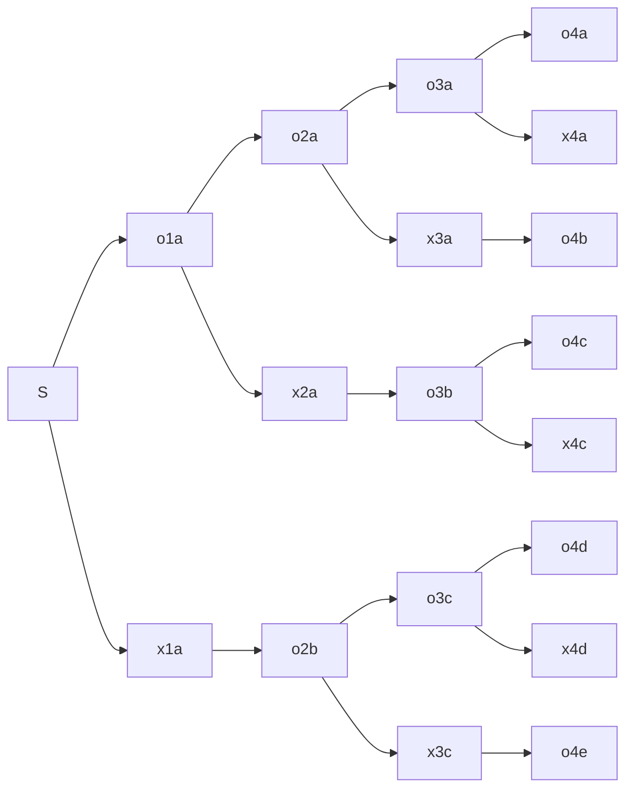

# 今回の結果
3AC

C問題は前回よりは易しい問題だったので、ここまでは解けてよかった。
D問題は解き方の検討がつかないなら見切りをつけてスキップし、Eに進むとE問題が取れた人もいたと思う。


# A - Six Characters 

https://atcoder.jp/contests/abc251/tasks/abc251_a

Difficulty: 9


## 問題文
英小文字からなる文字列 $S$ が与えられます。 $S$ の長さは $1$ 以上かつ $3$ 以下です。

$S$ を繰り返して得られる文字列であって、長さが $6$ のものを出力してください。

本問題の制約下で、そのような文字列はただ一つ存在することが示せます。

## 制約
- $S$ は英小文字からなる長さ $1$ 以上 $3$ 以下の文字列

## 入力
入力は以下の形式で標準入力から与えられる。

S

## 出力
答えとなる長さ $6$ の文字列を出力せよ。

## 入出力例

**入力例 1**

```
abc
```

**出力例 1**
```
abcabc
```

**入力例 2**
```
zz
```
**出力例 2**
```
zzzzzz
```

### 参加中に考えたこと

前回までのA問題に比べるとぐっと簡単なものに戻った感じがする。
Sの文字列長のパターンはせいぜい３つなので、if文で並べるもよし、6で割った数でfor文で回すもよし、やりやすい方で書けばいいかと。
自分はfor文で書きました。


# B - At Most 3 (Judge ver.)

https://atcoder.jp/contests/abc251/tasks/abc251_b

Difficulty: 181

## 問題文
おもり $1,$ おもり $2, …,$ おもり $N$ の $N$ 個のおもりがあります。おもり $i$ の重さは $A_i$ です。
以下の条件を満たす正整数 $n$ を **良い整数** と呼びます。

- **$3$ 個以下** の異なるおもりを自由に選んで、選んだおもりの重さの和を $n$ にすることができる。
$W$ 以下の正整数のうち、良い整数は何個ありますか？

## 制約
- $1≤N≤300$
- $1≤W≤10$
- $1≤A_i≤10^6$
- 入力される値はすべて整数

## 入力
入力は以下の形式で標準入力から与えられる。

N W
$A_1$ $A_2$ ... $A_N$ 
 
## 出力
答えを出力せよ。

## 入出力例

**入力例 1**
```
2 10
1 3
```
**出力例 1**
```
3
```

**入力例 2**
```
2 1
2 3
```
**出力例 2**
```
0
```

**入力例 3**
```
4 12
3 3 3 3
```

**出力例 3**
```
3
```

**入力例 4**
```
7 251
202 20 5 1 4 2 100
```
**出力例 4**
```
48
```

### 参加中に考えたこと
選ぶおもりは3個以下だから、1個選んで良い整数ができる場合、2個の場合、3個の場合をそれぞれ集計すればよさそう。
$N≤300$ だから３重ループでも $(3×10^2)^3 \fallingdotseq 10^6～10^7$ 程度の範囲だから計算量は問題ない。
求めるのは良い整数の個数だから、重複しないように取りうる範囲の配列でフラグを持っておいて、最後にフラグが立っている要素の数を数え上げたら求まる。
ここはset使って手抜きした。


# C - Poem Online Judge

https://atcoder.jp/contests/abc251/tasks/abc251_c

Difficulty: 246

## 問題文
ポエムオンラインジャッジ (Poem Online Judge, 以下 POJ と表記) は提出された文字列に得点をつけるオンラインジャッジです。
POJ に $N$ 回の提出がありました。早い方から $i$ 番目の提出では文字列 $S_i$ が提出されて、得点は $T_i$ でした。(同じ文字列が複数回提出される場合もあります)
ただし、POJ では **同じ文字列を提出しても得点が等しいとは限らない** のに注意してください。

$N$ 回の提出のうち、その提出よりも早い提出であって文字列が一致するものが存在しないような提出を **オリジナル** であると呼びます。
また、オリジナルな提出の中で最も得点が高いものを **最優秀賞** と呼びます。ただし、そのような提出が複数ある場合は、最も提出が早いものを最優秀賞とします。

最優秀賞は早い方から何番目の提出ですか？

## 制約
- $1≤N≤10^5$ 
- $S_i$ は英小文字からなる文字列
- $S_i$ の長さは $1$ 以上 $10$ 以下
- $0≤T_i≤10^9$
- $N, T_i$ は整数

## 入力
入力は以下の形式で標準入力から与えられる。

$N$
$S_1$ $T_1$
$S_2$ $T_2$
$\vdots$
$S_N$ $T_N$
 
## 出力
答えを出力せよ。

## 入出力例

**入力例 1**
```
3
aaa 10
bbb 20
aaa 30
```
**出力例 1**
```
2
```

**入力例 2**
```
5
aaa 9
bbb 10
ccc 10
ddd 10
bbb 11
```
**出力例 2**
```
2
```

**入力例 3**
```
10
bb 3
ba 1
aa 4
bb 1
ba 5
aa 9
aa 2
ab 6
bb 5
ab 3
```
**出力例 3**
```
8
```

### 参加中に考えたこと

最優秀賞を決める優先順位がいくつかあるが、整理すると以下の順序になる。
1. オリジナルである（自身と同じ文字列が既に提出されていない）
2. 1の中で得点が最も高い
3. 1と2を満たすもの同士の同点が同じ場合は、先に提出したほうが最優秀賞になる

判定するものが多いので、まずオリジナルだけをmap使って抜き出すことに。
ここで連想配列を使わないと恐らく$O(N^2)$ の計算量でTLEするケースが出てくる。
mapには得点と順序の2つが必要なので、`map<int<pair<int,int>>>` で定義。

オリジナルだけのデータができたら、ループして2と3の条件を見ながら答えを探す様なコードを書いてACできた。

### 考察・感想

後から気付いたけどかなり回いくどい実装をしてた。
上から順に入力を1行読むたびに最優秀賞になるかの判定までできるので、

- オリジナルかどうかを判定するための連想配列
- 最優秀賞の点数
- 最優秀賞が何番目か

の３つを持っておけば1つのループで十分だった。
これならオリジナルかどうかの判定もsetで文字列だけ持てば事足りた。


# D - At Most 3 (Contestant ver.)

https://atcoder.jp/contests/abc251/tasks/abc251_d

Difficulty: 1463

## 問題文
整数 $W$ が与えられます。
あなたは以下の条件をすべて満たすようにいくつかのおもりを用意することにしました。

- おもりの個数は $1$ 個以上 $300$ 個以下である。
- おもりの重さは $10^6$  以下の正整数である。
- 1 以上 $W$ 以下のすべての正整数は **良い整数** である。ここで、以下の条件を満たす正整数 $n$ を良い整数と呼ぶ。
  - 用意したおもりのうち **$3$ 個以下** の異なるおもりを自由に選んで、選んだおもりの重さの和を $n$ にすることができる。 　
条件を満たすようなおもりの組を $1$ つ出力してください。

## 制約
- $1≤W≤10^6$
- $W$ は整数

## 入力
入力は以下の形式で標準入力から与えられる。

W

## 出力
$N$ をおもりの個数、$A_i$ を $i$ 番目のおもりの重さとして、以下の形式で出力せよ。答えが複数存在する場合、どれを出力しても正解とみなされる。

$N$
$A_1$ $A_2$ $\cdots$ $A_N$ 
 
ただし、$N$ および $A_1$ $A_2$ $\cdots$ $A_N$ は以下の条件を満たす必要がある。

- $1≤N≤300$
- $1≤A_i≤10^6$
 
## 入出力例

**入力例 1**
```
6
```
**出力例 1**
```
3
1 2 3
```

**入力例 2**
```
12
```
**出力例 2**
```
6
2 5 1 2 5 1
```

### 参加中に考えたこと

1から順に書き出してみるも解法が閃かない。
$N≤300$ ということは、一番大きな $10^6$ でも300個あれば$1～10^6$の全ての良い整数が作れるということになる。
300という数字が何か意味あり気に感じるが。。
あと、 $W$ によって $N$ の最小値を求める必要があるのかと思ったが、問題文を見渡してもそのような記述が見当たらない。$N$ は固定で300を返してもいいのだろうか？
何か規則性を見つけないと解けない問題な気がしたので、この問題はスキップ。

### 考察・感想

公式解説のヒントを見て解法が分かった。
ヒント1～3を組み合わせると、$10^6$ の解は、

- $1,2,3,\cdots ,8,9$
- $10,20,30,\cdots ,80,90$
- $100,200,300,\cdots ,800,900$
- $1000,2000,3000,\cdots ,8000,9000$
- $10000,20000,30000,\cdots ,80000,90000$
- $100000,200000,300000,\cdots ,800000,900000$

この6つを1つずつ選べば良い整数が作れる。
但し、選べるのは6つではなく3つなので、その方法を考える。
上記の場合、$N=10×6=60$ で用意できるおもりの数にはまだ $240$ 個も余っている。
この数字を眺めていると、上の2行の和である $1～99$ は100個用意すれば1つで良い整数が作れることに気付いた。
同様に $100～9999$ と $10000～999999$ についても100個ずつ用意すれば $99×3=297$ 個を使って全て最大3つ選ぶという条件のもと、全ての良い整数が作れる。
$10^6$ を、${10^2}^3$ として考えるのがこの問題のポイントになる。
つまり必要なおもりは、

- $1,2,3,\cdots,97,98,99$
- $100,200,300,\cdots,9700,9800,9900$
- $10000,20000,30000,\cdots,970000,980000,990000$

このように用意しておけば良い。

そしてこの問題では $N$ の最小値を求める必要がないので、 $W$ の値に関係なく決まった出力するだけでいい。。
コードはA問題並に簡単で、アルゴリズムを理解さえすれば解けるという変わった形式の出題だった。

解説によれば、こういう問題は「構築/構成 (constructive problem) というジャンル名で呼ばれる」とのこと。
構築問題はある種の閃きを要求するので、パズルが得意な人だと解きやすいらしい。


# E - Tahakashi and Animals

https://atcoder.jp/contests/abc251/tasks/abc251_e

Difficulty: 1227

## 問題文
高橋君と $N$ 匹の動物がいます。 $N$ 匹の動物はそれぞれ動物 $1$ 、動物 $2$ 、… 、動物 $N$ と呼ばれます。

高橋君は下記の $N$ 種類の行動をそれぞれ好きな回数だけ（ $0$ 回でも良い）行います。

- $A_1$ 円払い、動物 $1$ と動物 $2$ に餌をあげる。
- $A_2$ 円払い、動物 $2$ と動物 $3$ に餌をあげる。
- $A_3$ 円払い、動物 $3$ と動物 $4$ に餌をあげる。
- $\cdots$
- $A_i$ 円払い、動物 $i$ と動物 $(i+1)$ に餌をあげる。
- $\cdots$
- $A_{N-2}$ 円払い、動物 $(N-2)$ と動物 $(N-1)$ に餌をあげる。
- $A_{N-1}$ 円払い、動物 $(N-1)$ と動物 $N$ に餌をあげる。
- $A_N$ 円払い、動物 $N$ と動物 $1$ に餌をあげる。
上記の $N$ 種類目の行動では、「動物 $N$ と動物 $1$ に」餌をあげることに注意してください。

すべての動物にそれぞれ $1$ 回以上餌をあげるまでにかかる費用の合計として考えられる最小値を出力してください。

## 制約
- $2≤N≤3×10^5$
- $1≤A_i≤10^9$
- 入力はすべて整数

## 入力
入力は以下の形式で標準入力から与えられる。

$N
$A_1$ $A_2$ $\cdots$ $A_N$
​ 
## 出力
すべての動物にそれぞれ $1$ 回以上餌をあげるまでにかかる費用の合計として考えられる最小値を出力せよ。

## 入出力例

**入力例 1**
```
5
2 5 3 2 5
```
**出力例 1**
```
7
```

**入力例 2**
```
20
29 27 79 27 30 4 93 89 44 88 70 75 96 3 78 39 97 12 53 62
```
出力例 2 
```
426
```

### 参加中に考えたこと

餌をあげる行動を一般化するとこの1行で表現できそう。
- $A_i$ 円払い、動物 $i$ と動物 $(i+1 \enspace mod \enspace N)$ に餌をあげる。
また、すべての動物に1回以上餌をあげる為の必要条件として以下が考えられる
- $A_i$ 円・ $A_{i+1}$ 円のどちらも払わないケースが存在しない
これを踏まえて費用の最小値を考えていく。

フローを考えるとこういう感じになる。
oは購入した場合、xは購入しなかった場合
（後ろの1aや2bはグラフの作成用として使っているので意味はなし）



$N≤3×10^5$ なので、DFS＋メモ化再帰かな？
と考えてコードを書いて入出力例２が上手くいかないところでタイムアップ

### 考察・感想

（作成中）

